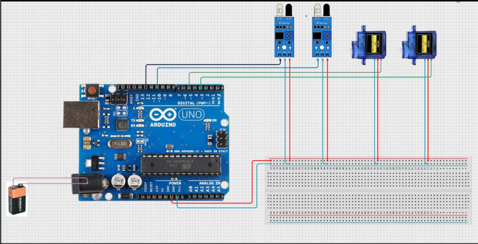

# Automated Railroad Crossing System  
This is a simple **Physics mini-project** that automates a railroad crossing using **Arduino, IR sensors, and servo motors**. The system detects an approaching train and lowers the gate automatically, ensuring safety **without human intervention**. 

## Features  
- Detects trains using IR sensors
- Automatically opens and closes the crossing gate using servo motors
- Affordable and efficient for railway safety

## Components Used
- Arduino Uno R3
- Servo Motors (x2)  
- IR Sensors (x2)  
- Jumper Wires, and Breadboard
- 9V Battery 

## Working Principle
1. When a train approaches, the first IR sensor detects it, and the gate closes automatically.
2. Once the train has passed, the second IR sensor confirms its departure, and the gate reopens.
3. The servos control the gate’s movement, making the system fully automated.
   
   
## If you want to try this project yourself, follow these steps:

## Installation & Usage
1. Clone the repository: git clone https://github.com/KartikHalkunde/Automated-Railroad-Crossing-System.git 
2. Open the .ino. file in Arduino IDE.
3. Connect the Arduino Uno to your PC and upload the code.
4. Assemble the circuit as shown in the documentation.
5. Power it up and observe the system in action!

( This is a simple project, but if you have ideas to improve it, feel free to fork the repo and submit a pull request! )
